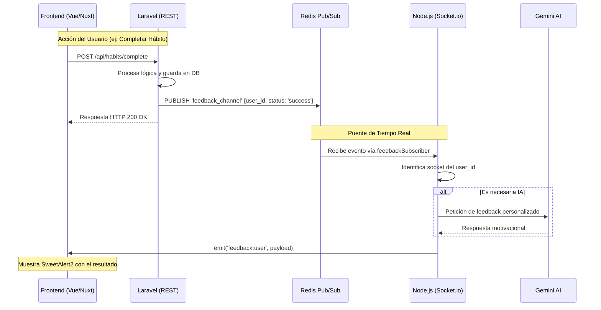

# Documentación Técnica del Backend - Loopy

Esta documentación detalla la arquitectura, el propósito de cada archivo y la red de comunicación del backend del proyecto Loopy.

## 1. Arquitectura General

El backend está dividido en dos microservicios principales que trabajan de forma coordinada:

*   **`backend-laravel`**: Actúa como el núcleo de lógica de negocio, persistencia de datos y gestión administrativa. Expone una API REST tradicional y orquestra eventos.
*   **`backend-node`**: Servidor de tiempo real basado en **Socket.io**. Se encarga de la comunicación bidireccional con el frontend y de la integración con la IA (Gemini).

### Red de Comunicación
La comunicación entre componentes se realiza mediante tres canales principales:
1.  **API REST**: El frontend consulta datos persistentes a Laravel.
2.  **WebSockets (Socket.io)**: Comunicación en tiempo real para notificaciones, chat y actualizaciones de estado.
3.  **Redis (Pub/Sub)**: Laravel publica eventos en un canal de Redis (`feedback_channel`) y Node.js los escucha para retransmitirlos a los clientes específicos vía sockets.

---

## 2. backend-laravel

Basado en PHP Laravel 10+, gestiona la base de datos (MySQL/MariaDB) y la lógica pesada.

### Estructura de Archivos Clave

| Carpeta / Archivo | Descripción |
| :--- | :--- |
| `app/Http/Controllers/Api` | Controladores que manejan las peticiones REST del frontend y del panel de admin. |
| `app/Models` | Representación de las tablas de la base de datos (Habit, User, Plantilla, Logro, etc.). |
| `app/Services` | **Capa de Lógica**: Contiene la lógica compleja separada de los controladores. |
| `app/Services/RedisFeedbackService.php` | Envía mensajes al canal de Redis para que Node.js los reciba. |
| `app/Console/Commands` | Tareas programadas (ej: procesar hábitos diarios). |
| `routes/api.php` | Punto de entrada de las rutas, dividido en `auth.php`, `user.php` y `admin.php`. |
| `database/migrations` | Definición de la estructura de las tablas de la base de datos. |

---

## 3. backend-node

Basado en Node.js, utiliza Socket.io para la capa de transporte en tiempo real.

### Estructura de Archivos Clave

| Archivo / Carpeta | Descripción |
| :--- | :--- |
| `src/index.js` | Punto de entrada. Inicializa el servidor HTTP, Socket.io y los suscriptores de Redis. |
| `src/socketHandler.js` | Orquestador de eventos de socket. Registra todos los "handlers" cuando un cliente se conecta. |
| `src/handlers/` | Lógica para responder a eventos específicos (ej: `habitHandlers.js`, `rouletteHandlers.js`). |
| `src/subscribers/feedbackSubscriber.js` | **Puente con Laravel**: Escucha el canal de Redis y entrega los datos al emisor correspondiente. |
| `src/middleware/jwtAuth.js` | Valida el token JWT del usuario antes de permitir la conexión por socket. |
| `src/shared/geminiService.js` | (Si aplica) Interfaz para comunicarse con la API de Google Generative AI. |

---

## 4. Red de Comunicación de Eventos

A continuación se muestra cómo fluye una acción desde que el usuario interactúa hasta que recibe feedback en tiempo real.

### Detalles del Flujo:
1.  **Laravel** detecta que algo ha cambiado (un logro desbloqueado, un hábito completado).
2.  Usa el `RedisFeedbackService` para enviar un JSON a **Redis**.
3.  **Node.js** está permanentemente suscrito a ese canal.
4.  Al recibir el JSON, **Node.js** busca al usuario conectado y le envía un mensaje por **Socket.io**.
5.  El **Frontend** tiene un listener que, al recibir el mensaje, dispara una interfaz (ej: SweetAlert2).

---
