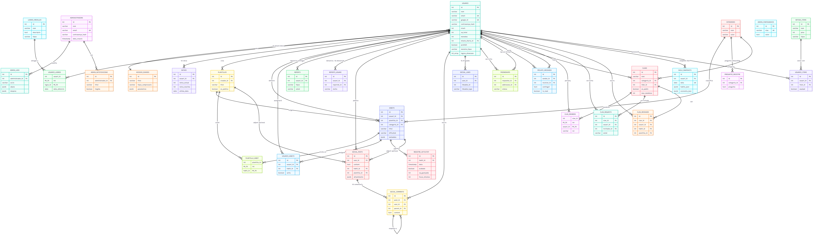

# Documentació Tècnica - Loopy

**Loopy** (*El Teu Habit Loop Gamificat*) és una aplicació web de seguiment d'hàbits amb gamificació, mascota evolutiva, funcionalitats socials (fòrum, amics, clans), botiga virtual i integració amb APIs externes. Aquest document correspon a l'**Apartat E** del projecte final de cicle (2n DAW, curs 2025-26, Grup 3).

| Metadada | Valor |
| :--- | :--- |
| **Autors** | Biel Domínguez, Llorenç Carnisser, Iker Mata, Iker Lopez |
| **Centre** | Institut Pedralbes |
| **Repositori** | `projecte-final-2025-26-daw-projecte_final_mvp1_grup3` |
| **Gestió del projecte** | [Taiga](https://tree.taiga.io/project/ikerlopezgomez-projecte_final_mvp1_grup5/timeline) |
| **Disseny UI** | [Figma](https://www.figma.com/design/XyO3s84xWpSUEjQk2fwktb/Aplicaci%C3%B3-habits?node-id=0-1&t=D6xaYpsrqnb5eyuY-1) |

---

## 1. Arquitectura del Codi i Patrons de Disseny

### 1.1 Visió general

Loopy implementa una **arquitectura modular en tres capes** amb separació clara de responsabilitats:

| Capa | Tecnologia | Responsabilitat principal |
| :--- | :--- | :--- |
| **Client** | Nuxt 3, Vue 3, Pinia, Tailwind CSS | Interfície d'usuari, gestió d'estat, i18n (ca/es/en) |
| **API REST (lectura)** | Laravel 11 (PHP 8.3) | Autenticació JWT, consultes GET, persistència, proxies d'APIs externes |
| **Temps real i CUD** | Node.js 20 + Socket.io | Esdeveniments en viu, cues Redis, onboarding amb Gemini |
| **Persistència** | PostgreSQL 16 | Dades relacionals (taules en majúscules) |
| **Missatgeria** | Redis 7 (LPUSH/BRPOP + Pub/Sub) | Pont asíncron entre Node i Laravel |

El patró fonamental és **GET via API Laravel** i **CUD (Create/Update/Delete) via Node → Redis → Worker Laravel → feedback per socket**. Això desacobla la UI del processament pesat i permet confirmacions en temps real sense bloquejar el client.

```text
┌─────────────┐     GET (JWT)      ┌──────────────────┐
│   Nuxt 3    │ ─────────────────► │  Laravel :8000   │
│  (Frontend) │                    │  (API REST)      │
└──────┬──────┘                    └────────┬─────────┘
       │ Socket.io                         │ PostgreSQL
       │ emit / on                         ▼
       ▼                          ┌──────────────────┐
┌─────────────┐   LPUSH queues    │   PostgreSQL     │
│  Node :3001 │ ◄───────────────► │   Redis 7        │
│  Socket.io  │   feedback_channel└──────────────────┘
└─────────────┘
```

### 1.2 Patrons de disseny aplicats

- **MVC (Laravel)**: Controladors prims; lògica de negoci als `Services/` i `Actions/`; models Eloquent per taula (`USUARIS`, `HABITS`, etc.).
- **Repository / Service Layer**: Operacions complexes (gamificació, ratxes, prohibicions, snapshots) encapsulades en serveis reutilitzables.
- **CQRS lleuger**: Lectura síncrona per HTTP; escriptura asíncrona per cua amb feedback.
- **Event-driven (Redis Pub/Sub)**: Laravel publica a `feedback_channel`; Node reemet a la sala `user_{id}` del client.
- **Store pattern (Pinia)**: Estat global al frontend (`useAuthStore`, `useHabitStore`, `useGameStore`, `useSocketUiCallbacks`).
- **Composables (Nuxt)**: Lògica reutilitzable (`useApi`, `useSocketBridge`, `useHomeSocketUi`).
- **Domain-driven folders (Node)**: `backend-node/src/domains/{Habits,Social,Admin,Roulette,...}`.

### 1.3 Estructura de carpetes del repositori

```text
projecte-final-2025-26-daw-projecte_final_mvp1_grup3/
├── frontend/                          # Client Nuxt 3 (SPA)
│   ├── components/
│   │   ├── shared/                    # Components transversals (modals, errors)
│   │   ├── user/                      # Home, hàbits, calendari, social
│   │   ├── admin/                     # Panell d'administració
│   │   ├── home/                      # Modals de joc (ratxa, evolució, ruleta)
│   │   └── clans/                     # Xat i gestió de clans
│   ├── composables/
│   │   ├── useApi.js                  # authFetch, capa HTTP unificada
│   │   ├── socket/                    # Pont Socket.io + registre de feedback
│   │   └── domains/                   # Lògica per domini (game, calendar...)
│   ├── stores/                        # Pinia (auth, habits, game, shop...)
│   ├── pages/                         # Rutes Nuxt (home, habits, social...)
│   ├── lang/                          # i18n: ca.json, es.json, en.json
│   ├── plugins/socket.client.js       # Connexió global Socket.io
│   └── nuxt.config.ts
│
├── backend-laravel/                   # API REST + workers
│   ├── app/
│   │   ├── Http/Controllers/Api/    # Controladors REST
│   │   ├── Domains/                 # Lògica per domini (Habits, Admin...)
│   │   ├── Services/                # Serveis de negoci
│   │   ├── Models/                    # Models Eloquent (taules majúscules)
│   │   └── Console/Commands/        # Workers Redis (unified-worker)
│   ├── routes/api/                  # auth.php, user.php, admin.php, calendar.php
│   └── config/                      # jwt.php, database.php, redis.php
│
├── backend-node/                    # Temps real + cues
│   ├── src/
│   │   ├── domains/                 # Handlers per domini (Habits, Social, WebRTC...)
│   │   ├── queues/                    # habitQueue, plantillaQueue, adminQueue...
│   │   ├── subscribers/               # feedbackSubscriber + emitters
│   │   ├── middleware/jwtAuth.js      # Validació JWT al handshake
│   │   └── socketHandler.js           # Registre d'esdeveniments Socket.io
│   └── package.json
│
├── database/
│   ├── init.sql                       # Esquema PostgreSQL (sense migracions Laravel)
│   └── insert.sql                     # Dades inicials / seed
│
├── docker/
│   ├── docker-compose.yml             # Orquestració de serveis
│   ├── Dockerfile.laravel
│   ├── Dockerfile.node
│   └── Dockerfile.frontend
│
├── doc/                               # Documentació del projecte
│   ├── E_DOCUMENTACIO_TECNICA.md      # Aquest fitxer (Apartat E)
│   └── img/                           # Captures i diagrames
│
├── .github/workflows/deploy.yml       # CI/CD (lint, test, deploy SSH)
├── .env.example                       # Variables unificades
└── README.md
```

### 1.4 Convencions de codi

| Àmbit | Convenció |
| :--- | :--- |
| **Backend Node** | JavaScript ES5 estricte (`var`, `function()`, sense arrow functions) |
| **Backend Laravel** | PHP 8.3, camelCase, comentaris en català, sense operador ternari |
| **Frontend** | Vue 3 Composition/Options API, composables per domini |
| **Base de dades** | Taules i columnes en **MAJÚSCULES** (`USUARIS`, `HABITS`); canvis via `database/init.sql` (no migracions Laravel per defecte) |
| **API** | Paràmetres de ruta preferits sobre query string (`/api/preguntes-registre/{categoria_id}`) |
| **Control de versions** | Git amb branques `feature/*`, `main` com a producció; PRs amb revisió |

### 1.5 Eines de qualitat i proves

| Eina | Ús |
| :--- | :--- |
| **Laravel Pint** | Format i estil PHP (`backend-laravel`) |
| **PHPUnit** | Tests de funcionalitat Laravel (`tests/Feature/`) |
| **Vitest** | Tests unitaris frontend (`frontend/tests/unit/`) |
| **Playwright / Cypress** | Tests E2E (`frontend/tests/e2e/`, `frontend/cypress/`) |
| **GitHub Actions** | Lint, test i desplegament automàtic en push a `main` |
| **ESLint** (via Nuxt build) | Verificació en compilació del frontend |

---

## 2. Guia de l'Onboarding ("Per on començar")

### 2.1 Requisits previs

Abans d'instal·lar Loopy en local, assegura't de disposar del següent programari:

| Programari | Versió recomanada | Notes |
| :--- | :--- | :--- |
| **Git** | 2.40+ | Per clonar el repositori |
| **Docker Desktop** | 4.x+ | Motor de contenidors (Windows/macOS/Linux) |
| **Docker Compose** | v2 (inclòs a Docker Desktop) | Orquestració multi-servei |
| **Node.js** (opcional, fora Docker) | 20.11.x | Només si vols executar frontend/Node sense contenidor |
| **PHP** (opcional) | 8.3 | Només per desenvolupament Laravel fora de Docker |
| **Editor** | VS Code / Cursor | Recomanat amb extensions Vue, PHP, Docker |

**Ports utilitzats per defecte** (comprova que estiguin lliures):

| Servei | Port host |
| :--- | :--- |
| Frontend (Nuxt) | `3000` |
| Backend Node (Socket.io) | `3001` |
| Backend Laravel (via Nginx) | `8000` |
| PostgreSQL | `5433` (mapatge intern `5432`) |
| Redis | `6380` (mapatge intern `6379`) |
| Adminer (gestor BD) | `8081` |

### 2.2 Instal·lació pas a pas (Docker)

#### Pas 1: Clonar el repositori

```bash
git clone https://github.com/inspedralbes/projecte-final-2025-26-daw-projecte_final_mvp1_grup3.git
cd projecte-final-2025-26-daw-projecte_final_mvp1_grup3
```

#### Pas 2: Configurar variables d'entorn

```bash
cp .env.example .env
```

Edita el fitxer `.env` a l'arrel. Com a mínim, configura:

```bash
# Generar un secret JWT compartit entre Laravel i Node:
node -e "console.log(require('crypto').randomBytes(32).toString('hex'))"
```

Copia el resultat a `JWT_SECRET=` al `.env`. També pots ajustar credencials de PostgreSQL si cal.

Variables crítiques:

```env
JWT_SECRET=<el_teu_secret_generat>
SOCKET_URL=http://localhost:3001
API_URL=http://localhost:8000
DB_DATABASE=loopy_db
DB_USERNAME=loopy
DB_PASSWORD=loopy_secret
```

Per a funcionalitats opcionals (onboarding IA, APIs externes):

```env
GEMINI_API_KEY=<clau_google_gemini>
OPENWEATHER_API_KEY=<clau_openweather>
GOOGLE_BOOKS_API_KEY=<clau_google_books>
YOUTUBE_DATA_API_KEY=<clau_youtube>
WGER_API_TOKEN=<token_wger>
```

#### Pas 3: Engegar els contenidors

```bash
cd docker
docker compose up -d --build
```

Això aixeca: PostgreSQL, Redis, Laravel (+ Nginx), Node, frontend Nuxt i Adminer.

#### Pas 4: Inicialitzar la base de dades

L'esquema s'aplica automàticament des de `database/init.sql` i `database/insert.sql` en crear el volum de Postgres. Si cal reaplicar migracions Laravel addicionals:

```bash
docker compose exec backend-laravel php artisan migrate
```

Generar clau d'aplicació Laravel (primera vegada):

```bash
docker compose exec backend-laravel php artisan key:generate
```

#### Pas 5: Verificar el worker Redis

El worker unificat processa cues (`habits_queue`, `plantilles_queue`, `admin_queue`, `roulette_queue`) i publica feedback a Socket.io. S'inicia automàticament amb Docker (`backend-laravel-redis-worker`). Per executar-lo manualment:

```bash
docker compose exec backend-laravel php artisan redis:unified-worker
```

#### Pas 6: Accedir a l'aplicació

| Servei | URL |
| :--- | :--- |
| **Aplicació (usuari)** | http://localhost:3000 |
| **API Laravel** | http://localhost:8000/api |
| **Socket.io** | http://localhost:3001 |
| **Adminer (BD)** | http://localhost:8081 |

Credencials de prova: consulta `database/insert.sql` o el manual d'usuari.

#### Pas 7: Aturar l'entorn

```bash
cd docker
docker compose down
```

Per esborrar volums i reiniciar la BD des de zero:

```bash
docker compose down -v
```

### 2.3 Desenvolupament sense Docker (opcional)

Si prefereixes executar serveis a mà:

```bash
# Terminal 1 – Laravel
cd backend-laravel
composer install
cp .env.example .env
php artisan key:generate
php artisan serve --port=8000

# Terminal 2 – Worker Redis
php artisan redis:unified-worker

# Terminal 3 – Node
cd backend-node
npm install
npm start

# Terminal 4 – Frontend
cd frontend
npm install
npm run dev
```

Assegura't que PostgreSQL i Redis estiguin actius i que les variables del `.env` apuntin a `127.0.0.1` en lloc dels noms de servei Docker.

---

## 3. Model de Dades i Persistència

### 3.1 Gestió de la persistència

Loopy utilitza **PostgreSQL 16** com a base de dades relacional. L'esquema es defineix al fitxer versionat `database/init.sql` (no s'utilitzen migracions Laravel com a font principal de l'esquema, segons les normes del projecte). Les dades inicials (categories, missions, ítems de botiga, etc.) es carreguen des de `database/insert.sql` en el primer arranc del contenidor Postgres.

Els models Laravel (`app/Models/`) mapen cada taula amb la propietat `$table` en majúscules i `$timestamps = false` quan no hi ha columnes `created_at`/`updated_at`.

### 3.2 Entitats principals

| Domini | Taules clau | Descripció |
| :--- | :--- | :--- |
| **Identitat** | `USUARIS`, `ADMINISTRADORS` | Usuaris finals i administradors del sistema |
| **Hàbits** | `HABITS`, `USUARIS_HABITS`, `CATEGORIES`, `REGISTRE_ACTIVITAT` | Definició d'hàbits, assignació a usuaris i registre diari |
| **Gamificació** | `RATXES`, `MISSIOS_DIARIES`, `LOGROS_MEDALLES`, `USUARIS_LOGROS` | Ratxes, missions diàries, assoliments i medalles |
| **Plantilles** | `PLANTILLES`, `PLANTILLA_HABIT` | Paquets d'hàbits reutilitzables |
| **Social** | `SOCIAL_POSTS`, `SOCIAL_COMMENTS`, `SOCIAL_LIKES` | Fòrum social |
| **Amistat** | `FRIENDSHIPS`, `PRIVATE_MESSAGES` | Relacions i xat privat |
| **Clans** | `CLANS`, `CLAN_MEMBERS`, `CLAN_MESSAGES`, `CLAN_REQUESTS` | Grups cooperatius |
| **Botiga** | `BOTIGA_ITEMS`, `USUARIS_ITEMS` | Catàleg i inventari d'usuari |
| **Calendari** | `DAILY_SNAPSHOTS` | Resum mensual d'activitat |
| **Moderació** | `REPORTS`, `REPORTS_USUARI` | Denúncies de contingut i usuaris |
| **Admin** | `ADMIN_LOGS`, `ADMIN_NOTIFICACIONS`, `ADMIN_CONFIGURACIO` | Auditoria i configuració |

### 3.3 Camps rellevants

- **`USUARIS`**: `nivell`, `xp_total`, `monedes`, `monstre_tipus`, `prohibit`, `motiu_prohibicio`, `dies_prohibicio` (sistema de ban).
- **`HABITS`**: `dificultat` (facil/mitja/dificil → XP 100/250/400), `metadata` (JSONB per APIs externes: llibres, exercicis, vídeos).
- **`RATXES`**: `ratxa_actual`, `ratxa_maxima` per usuari.

### 3.4 Diagrama Entitat-Relació

El diagrama E/R complet del model de dades es mostra a continuació. Reflecteix totes les entitats principals de PostgreSQL definides a `database/init.sql` (identitat, hàbits, gamificació, social, clans, botiga i administració).



*Figura 1: Diagrama entitat-relació de la base de dades Loopy (PostgreSQL).*

### 3.5 Redis com a capa auxiliar

A més de PostgreSQL, **Redis** s'utilitza per:

- **Cues de treball** (`habits_queue`, `plantilles_queue`, `admin_queue`, `roulette_queue`): LPUSH des de Node, BRPOP des del worker Laravel.
- **Pub/Sub** (`feedback_channel`): Laravel publica resultats; Node subscriu i reemet per Socket.io.
- **Cache i sessions** Laravel (`CACHE_DRIVER=redis`, `SESSION_DRIVER=redis`).

---

## 4. Referència de l'API i Rutes Clau

Totes les rutes REST de Laravel tenen el prefix base:

```text
http://localhost:8000/api
```

L'autenticació d'usuari utilitza el header:

```http
Authorization: Bearer <token_jwt>
```

### 4.1 Autenticació i registre

| Mètode | URL | Paràmetres / Body | Respostes |
| :--- | :--- | :--- | :--- |
| `POST` | `/auth/register` | `{ "nom", "email", "contrasenya", "contrasenya_confirmation" }` | `201` Creat; `422` Validació; `409` Email duplicat |
| `POST` | `/auth/login` | `{ "email", "contrasenya" }` | `200` + `{ "token", "user" }`; `401` Credencials; `403` Compte prohibit (`account_banned`) |
| `POST` | `/auth/refresh` | Header `Authorization` | `200` Nou token; `401` Token invàlid |
| `POST` | `/auth/logout` | Header `Authorization` | `200` Sessió tancada |
| `GET` | `/auth/google/redirect` | — | `302` Redirecció OAuth Google |
| `GET` | `/auth/google/callback` | Query OAuth | `302` Retorn amb token o error |

**Exemple de petició de login:**

```bash
curl -X POST http://localhost:8000/api/auth/login \
  -H "Content-Type: application/json" \
  -d '{"email":"usuari@exemple.com","contrasenya":"secret123"}'
```

**Exemple de resposta correcta (200):**

```json
{
  "token": "eyJ0eXAiOiJKV1QiLCJhbGc...",
  "user": {
    "id": 1,
    "nom": "Usuari Prova",
    "email": "usuari@exemple.com",
    "nivell": 3
  }
}
```

### 4.2 Hàbits i estat de joc (GET autenticat)

| Mètode | URL | Paràmetres | Respostes |
| :--- | :--- | :--- | :--- |
| `GET` | `/habits` | Header JWT | `200` Llista d'hàbits de l'usuari; `401` No autenticat |
| `GET` | `/habits/{id}` | `id` a la ruta | `200` Detall; `404` No trobat |
| `GET` | `/game-state` | Header JWT | `200` XP, nivell, monedes, ratxa |
| `GET` | `/user/home` | Header JWT | `200` Dades agregades del dashboard |
| `POST` | `/habits/complete` | `{ "habit_id", "data" }` | `200`/`422`; completar via API (alternativa al socket) |

> **Nota arquitectònica:** Les operacions CUD d'hàbits (crear, editar, eliminar, completar) s'envien preferentment per **Socket.io** (`habit_action` → cua Redis). El feedback arriba per l'esdeveniment `habit_action_confirmed`.

### 4.3 Social i perfil

| Mètode | URL | Paràmetres | Respostes |
| :--- | :--- | :--- | :--- |
| `GET` | `/social/posts` | Paginació interna | `200` Llista de publicacions |
| `POST` | `/social/posts` | `{ "contingut", "adjunts" }` | `201` Creat; `422` Validació |
| `GET` | `/user/profile` | Header JWT | `200` Perfil propi |
| `PUT` | `/users/self/account` | `{ "nom", "email", ... }` | `200` Actualitzat; `422` Validació |

### 4.4 Botiga

| Mètode | URL | Paràmetres | Respostes |
| :--- | :--- | :--- | :--- |
| `GET` | `/shop` | Header JWT | `200` Catàleg d'ítems |
| `POST` | `/shop/comprar/{itemId}` | `itemId` a la ruta | `200` Compra OK; `400` Fons insuficients |

### 4.5 Administració

| Mètode | URL | Paràmetres | Respostes |
| :--- | :--- | :--- | :--- |
| `POST` | `/admin/auth/login` | `{ "email", "contrasenya" }` | `200` Token admin (`role=admin`) |
| `PUT` | `/admin/usuaris/{id}/prohibir` | `{ "prohibit", "motiu_prohibicio", "durada_prohibicio" }` | `200` Usuari prohibit/desprohibit |

Les rutes `/admin/*` requereixen middleware `ensure.admin` amb JWT que inclou `role: admin`.

### 4.6 APIs externes (proxy segur)

Les claus d'API **no s'exposen al client**. Nuxt crida Laravel:

| Mètode | URL | Descripció |
| :--- | :--- | :--- |
| `GET` | `/external/books` | Cerca Google Books |
| `GET` | `/external/workouts` | Exercicis Wger |
| `GET` | `/external/videos` | YouTube Data API |
| `GET` | `/external/weather` | OpenWeather (context hàbits de llar) |

### 4.7 Esdeveniments Socket.io (temps real)

Connexió: `io(SOCKET_URL, { auth: { token: JWT } })`.

| Esdeveniment (client ← servidor) | Descripció |
| :--- | :--- |
| `habit_action_confirmed` | Confirmació CUD d'hàbit |
| `update_xp` | Actualització XP, monedes, ratxa |
| `streak_broken` | Ratxa trencada |
| `level_up` | Pujada de nivell |
| `mission_completed` | Missió diària completada |
| `roulette_result` | Resultat de la ruleta diària |
| `shop_event` | Confirmació de compra/equipar |

| Esdeveniment (client → servidor) | Descripció |
| :--- | :--- |
| `habit_action` | Crear/editar/eliminar/completar hàbit |
| `roulette_spin` | Tirada de ruleta |
| `plantilla_action` | CUD de plantilles |

---

## 5. Seguretat i Gestió d'Accessos

### 5.1 Autenticació JWT

Loopy utilitza **JSON Web Tokens (JWT)** signats amb HS256, compartint el secret `JWT_SECRET` entre Laravel i Node.js (`php-open-source-saver/jwt-auth` al backend PHP i `jsonwebtoken` al backend Node).

**Flux d'autenticació d'usuari:**

1. L'usuari envia credencials a `POST /api/auth/login`.
2. Laravel valida email/contrasenya (bcrypt) i comprova si el compte està prohibit (`USUARIS.prohibit`).
3. Si és vàlid, es genera un JWT amb claims com `user_id`, `email`, `role: user`.
4. El frontend emmagatzema el token (Pinia `useAuthStore`) i l'envia en cada petició GET:

```http
Authorization: Bearer <token>
```

5. Al connectar Socket.io, el token es passa al handshake:

```javascript
io(SOCKET_URL, { auth: { token: authStore.token } });
```

6. El middleware `jwtAuth.js` de Node verifica el token abans d'acceptar la connexió.

**Refresh i logout:**

- `POST /api/auth/refresh`: renova el token abans de caducar (`JWT_TTL`, per defecte 60 minuts).
- `POST /api/auth/logout`: invalida el token (blacklist JWT habilitada a Laravel).

### 5.2 Protecció de rutes API

| Middleware | Àmbit | Funció |
| :--- | :--- | :--- |
| *(cap)* | `/auth/login`, `/auth/register`, onboarding | Rutes públiques |
| `ensure.user` | `/habits`, `/social/*`, `/shop`, etc. | Exigeix JWT vàlid amb rol d'usuari |
| `ensure.admin` | `/admin/*` | Exigeix JWT amb `role=admin` |

Si el token és invàlid o ha expirat, Laravel retorna **`401 Unauthorized`**. Si l'usuari està prohibit, el login retorna **`403`** amb el codi `account_banned` i dades del ban (motiu, durada).

### 5.3 Autenticació d'administrador

Els administradors tenen taula pròpia (`ADMINISTRADORS`) i login separat (`POST /api/admin/auth/login`). El JWT inclou `role: admin` i `admin_id`. El panell admin del frontend utilitza stores i composables dedicats (`useAdminApi`, `useAdminSocket`).

### 5.4 Seguretat de dades i APIs externes

- Les claus de Gemini, OpenWeather, Google Books, YouTube i Wger resideixen **només** al `.env` del servidor Laravel.
- El camp `HABITS.metadata` (JSONB) només persisteix camps normalitzats (`api_id`, `titol`, `url_imatge`, `tipus_api`), mai claus secretes.
- CORS configurat a `backend-laravel/config/cors.php` per limitar orígens en producció.
- Contrasenyes amb hash **bcrypt**; mai en clar a la base de dades.

### 5.5 OAuth Google

Registre/login social via Laravel Socialite (`/auth/google/redirect` i `/auth/google/callback`). El `google_id` s'emmagatzema a `USUARIS` amb restricció UNIQUE.

### 5.6 Moderació i prohibició

Els administradors poden prohibir usuaris (`prohibit`, `motiu_prohibicio`, `durada_prohibicio`). Un usuari prohibit no pot iniciar sessió. La implementació de notificació en temps real del ban durant la sessió activa és una millora prevista via esdeveniment Socket `account_banned`.

---

## 6. Entorn de Desplegament (Deployment)

### 6.1 Estratègia de desplegament

Loopy es desplega com a **stack Docker** en un servidor Linux (VPS), orquestrat amb el mateix `docker/docker-compose.yml` que en desenvolupament, amb variables de producció al fitxer `.env` de l'arrel del servidor.

| Entorn | Descripció |
| :--- | :--- |
| **Desenvolupament** | `docker compose up` en local; `APP_DEBUG=true` |
| **Producció** | Servidor remot; `APP_ENV=production`, `APP_DEBUG=false`; referència `.env.prod.example` |

### 6.2 CI/CD amb GitHub Actions

El fitxer `.github/workflows/deploy.yml` defineix el pipeline automàtic:

```text
Push/PR a main
    │
    ├─► Job Lint: npm ci + build frontend (Nuxt)
    │
    ├─► Job Test: PHPUnit (BasicRoutesTest) + PostgreSQL + Redis efímers
    │
    ├─► Job Deploy (només push a main):
    │       • SSH al servidor (secrets: SERVER_HOST, SERVER_USER, SERVER_SSH_KEY, APP_DIR)
    │       • git pull origin/main
    │       • Copiar .env a backend-laravel i frontend
    │       • docker compose build && docker compose up -d
    │       • php artisan migrate --force
    │       • php artisan config:cache && route:cache
    │       • Health check (API + port 3000)
    │
    └─► Job Tag: crea tag semàntic vX.Y.Z automàtic
```

**Secrets necessaris a GitHub** (configuració del repositori):

- `SERVER_HOST`, `SERVER_USER`, `SERVER_SSH_KEY`, `SERVER_PORT`
- `APP_DIR` (ex: `/opt/loopy`)

### 6.3 Servidors i serveis en producció

| Servei | Contenidor Docker | Funció |
| :--- | :--- | :--- |
| `frontend` | Nuxt (build de producció) | Interfície web (:3000) |
| `backend-node` | Node.js + Socket.io | Temps real (:3001) |
| `backend-laravel` | PHP-FPM | API REST |
| `nginx` | Reverse proxy | Exposa Laravel (:8000) |
| `postgres` | PostgreSQL 16 | Base de dades |
| `redis` | Redis 7 | Cues i Pub/Sub |
| `backend-laravel-redis-worker` | Artisan worker | Processament de cues |

### 6.4 Configuració de producció

Abans del primer desplegament al servidor:

```bash
# Al servidor, a l'arrel del projecte clonat:
cp .env.prod.example .env
# Editar: APP_URL, DB_PASSWORD, JWT_SECRET, claus API, APP_DEBUG=false
```

Generar `APP_KEY` de Laravel:

```bash
docker compose exec backend-laravel php artisan key:generate
```

### 6.5 Demo pública

> **Nota:** Inseriu aquí l'URL de la demo en producció quan estigui disponible, per exemple: `https://loopy.exemple.cat`

| Recurs | URL |
| :--- | :--- |
| **Aplicació web (demo)** | *Pendent de configurar — consultar README o professor* |
| **Repositori GitHub** | *URL del repositori del grup* |
| **Taiga (gestió)** | https://tree.taiga.io/project/ikerlopezgomez-projecte_final_mvp1_grup5/timeline |

### 6.6 Flux Git recomanat

```text
feature/nom-funcionalitat  →  Pull Request  →  main  →  Deploy automàtic
```

- Desenvolupament en branques `feature/*`.
- Revisió per codi abans de fusionar a `main`.
- Cada merge a `main` dispara lint, tests i desplegament (si els secrets estan configurats).

### 6.7 Monitoratge post-desplegament

Després del deploy, el workflow executa un health check que verifica:

1. Resposta de `php artisan tinker` dins del contenidor Laravel.
2. Port `3000` del frontend accessible des del servidor.

En cas de fallada, revisar logs:

```bash
cd /opt/loopy/docker   # o APP_DIR configurat
docker compose logs -f backend-laravel
docker compose logs -f backend-node
docker compose logs -f frontend
```

---

## Annex A: Stack tecnològic complet

| Component | Tecnologia | Versió |
| :--- | :--- | :--- |
| Frontend | Nuxt 3, Vue 3, Pinia, Tailwind CSS, @nuxtjs/i18n | Nuxt 3.10+ |
| Client mòbil (opcional) | Capacitor 6 | — |
| API REST | Laravel | 11.x |
| Llenguatge servidor | PHP | 8.3 |
| Temps real | Node.js, Socket.io | Node 20.x, Socket.io 4.7 |
| IA onboarding | Google Gemini API | gemini-1.5-flash |
| Base de dades | PostgreSQL | 16.2 |
| Cache / cues | Redis | 7.2 |
| Auth | JWT (HS256) | php-open-source-saver/jwt-auth |
| OAuth | Laravel Socialite (Google) | 5.x |
| Contenidors | Docker, Docker Compose | — |
| CI/CD | GitHub Actions | — |
| Tests | PHPUnit, Vitest, Playwright, Cypress | — |

---

## Annex B: Documentació relacionada

| Document | Ubicació |
| :--- | :--- |
| Manual d'usuari | `doc/MANUAL_USUARI.md` |
| Guia Docker | `docker/README.md` |
| Arquitectura backend (detall) | `doc/arquitectura_backend/` |
| Setup des de zero | `doc/setup_migracions/01-SETUP-DESDE-CERO.md` |

---

*Document generat per al Projecte Final de Cicle — Loopy — Grup 3 — Curs 2025-26.*
